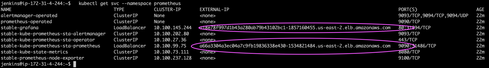

# Setup

<!-- SETUP TABLE OF CONTENTS -->

  
Cloud Cluster Setup Table of Contents

  <ol>
    <li>
      <a href="#clusters-on-google-kubernetes-engine">Initialize a Cluster on Google Cloud Services</a>
      <ul>
        <li><a href="#GKE---initialize-a-cluster">GKE - Initialize a Cluster</a></li>
        <li><a href="#GKE---edit-grafana-config-map">GKE - Edit Config Map</a></li>
        <li><a href="#GKE---expose-service">GKE - Expose Service</a></li>
      </ul>
    </li>
    <li>
      <a href="#initialize-a-cloud-cluster-on-amazon-web-services">Initialize a Cluster on Amazon Web Services</a>
      <ul>
        <li><a href="#aws---initialize-a-cluster">AWS - Initialize a Cluster</a></li>
        <li><a href="#aws---edit-grafana-config-map">AWS - Edit Config Map</a></li>
      </ul>
    </li>
    <li>
      <a href="#expose-prometheus-and-grafana-services">Expose Prometheus and Grafana Services</a>
    </li>
    <li>
      <a href="#export-your-rbac-bindings-to-your-localhost">Export your RBAC bindings to your localhost</a>
    </li>
  </ol>

# Clusters on Google Kubernetes Engine
## GKE - Initialize a Cluster
1. To create a project and set up a standard cluster with the resources of your choice, go to [Google Cloud Services](https://console.cloud.google.com/kubernetes/)
        
2. Get cluster credentials & authorize cloud shell

        gcloud container clusters get-credentials [cluster name] --region=[region]

3. Install helm

        % curl -fsSL -o get_helm.sh https://raw.githubusercontent.com/helm/helm/main/scripts/get-helm-3
      	% chmod 700 get_helm.sh
        % ./get_helm.sh

4. Add Repo for Prometheus Community Helm Chart

        helm repo add prometheus-community https://prometheus-community.github.io/helm-charts 

5. Update Repos

        helm repo update 

6. Create Prometheus namespace 

        kubectl create namespace prometheus

6. Install Prometheus Kube Stack 

        helm install stable prometheus-community/kube-prometheus-stack -n prometheus

7. Expose your Prometheus and Grafana IP address

## GKE - Edit Grafana Config Map

1. Under Secrets & ConfigMaps, select the Prometheus-Grafana Config Map and select the Edit button near the top of the screen to edit the config map.

2. Insert the following parameters in grafana.ini within the Data Category:
    * This will enable embedding and authorization to view grafana panels and dashboards from outside sources.

          [security]
          allow_embedding: true
          [auth.anonymous]
          enabled: true
          [dataproxy]
          timeout: 600
        
# Initialize a Cloud Cluster on Amazon Web Services
## AWS - Initialize a Cluster
1. Visit [Amazon Web Services](https://aws.amazon.com/eks/) to create an Elastic Kubernetes Service cluster with your preferred resources.

2. Create a [node IAM role](https://docs.aws.amazon.com/eks/latest/userguide/create-node-role.html#create-worker-node-role), a [service role](https://docs.aws.amazon.com/eks/latest/userguide/service_IAM_role.html#create-service-role), and [the kubeconfig](https://docs.aws.amazon.com/eks/latest/userguide/create-kubeconfig.html).

3. [Install Helm](https://docs.aws.amazon.com/eks/latest/userguide/helm.html).        

4. Add Repo for Prometheus Community Helm Chart

        helm repo add prometheus-community https://prometheus-community.github.io/helm-charts 

5. Update Repos

        helm repo update 

6. Create Prometheus monitoring namespace

        kubectl create namespace prometheus

7. Install Prometheus Kube Stack

        helm install stable prometheus-community/kube-prometheus-stack -n prometheus
    * Prometheus Kube Stack includes Grafana out of the box

## AWS - Edit Grafana Config Map

1. Under EKS, select Clusters, then select the name of your cluster. Then under the Resources tab, in the Resource Types sidebar, select Config and Secrets and then select Configmaps.

2. Edit the prometheus-grafana config map and insert the following parameters in grafana.ini within the Data Category:
    * This will enable embedding and authorization to view grafana panels and dashboards from outside sources.

          [security]
          allow_embedding: true
          [auth.anonymous]
          enabled: true
          [dataproxy]
          timeout: 600

## Expose Prometheus and Grafana Services

1. In your Kubectl command line on your cloud platform of choice(Google Cloud Command Line or EKSCTL), get the names of the Prometheus and Grafana services

        kubectl get svc -n prometheus

2. Edit Prometheus service AND Grafana Services
    Prometheus

        kubectl edit svc stable-kube-prometheus-sta-prometheus -n prometheus

    Grafana

        kubectl edit svc stable-grafana -n prometheus

3. In order to make prometheus and grafana available outside the cluster, change type from ClusterIP to LoadBalancer.
        

3. Check if the services were successfully changed 

        kubectl get svc -n prometheus

4. You can see that the services are successfully changed to LoadBalancer, and you can also grab the external IP of your Grafana Service. This is important as you will import this to external IP into our application.
        

5. Delete the old pods that are running the old clusterIP configurations. 
    * This will display the name of the current pods. Copy the full name of the prometheus-grafana pod.
    
          kubectl get pods -n prometheus
    * Delete the pod, inserting the full name.
    * Make sure to delete the pods of both the stable-grafana and stable-kube-prometheus-sta-prometheus
    
          kubectl delete pod [pod name] -n default

## Export your RBAC bindings to your localhost
1. In your Google Cloud Command Line or EKSCtl, export your cluster role bindings or role bindings into json. 

        kubectl get clusterrolebindings -n [namespace] -o=json > [yourFileName].json

2. Google Cloud Users
    If you are using Google Cloud, you will need to download this file onto your local host
        

    Input the filename you specified and then you will be able to download the JSON file to view in our app.

    If you are an EKS user, EKSCtl will automatically download the file to your local directory of choice.

3. Run KubeHawk on your localhost and you should be able to drag and drop your JSON file for easy RBAC visualization!
